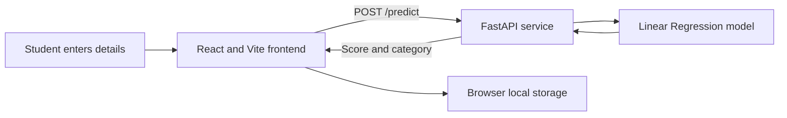

<div align="center">

# 🎓 Student Performance Predictor

### Turn everyday learning habits into a clearer picture of academic progress.

[](https://student-performance-predictor-virid.vercel.app/)
[](https://react.dev/)
[](https://vite.dev/)
[](https://fastapi.tiangolo.com/)
[](https://www.python.org/)

**[Open the live demo](https://student-performance-predictor-virid.vercel.app/)** · [Explore the code](https://github.com/mehulikhanra904-prog/student-performance-predictor)

</div>

---

## ✨ About

Student Performance Predictor is a full-stack machine-learning application that estimates a student's final score from study habits and academic indicators. Enter a few details to receive a predicted score, a performance category, and practical suggestions based on the information provided.

The project brings together a responsive React interface, a FastAPI prediction service, and a Linear Regression model trained with scikit-learn.

> **Learning project:** Predictions are estimates from a small sample dataset. They are intended for exploration and demonstration, not as a definitive measure of a student's ability or future results.

## 🚀 Features

- **Score prediction** from six academic and lifestyle inputs.
- **Performance category** alongside the predicted score.
- **Personalized suggestions** based on the values entered.
- **Model information** including the model name, training and testing sample counts, MAE, RMSE, and R² score.
- **Recent prediction history** saved in the browser with local storage.
- **Responsive interface** for desktop and mobile screens.
- **Separate frontend and backend** that communicate through a JSON REST API.

## 🧾 Inputs

| Input | Description | Accepted range |
| --- | --- | --- |
| Study hours | Average hours spent studying per day | 0–24 |
| Attendance | Attendance percentage | 0–100 |
| Previous score | Previous academic score | 0–100 |
| Assignments completed | Completed assignments | 0–100 |
| Sleep hours | Average hours of sleep per day | 0–24 |
| Participation | Class participation indicator | 0–100 |

The API returns a predicted score between 0 and 100 and one of these categories: **Excellent**, **Good**, **Average**, **Needs Improvement**, or **At Risk**.

## 🧰 Technology

- **Frontend:** React, Vite, JavaScript, CSS
- **Backend:** Python, FastAPI, Pydantic
- **Machine learning:** scikit-learn Linear Regression
- **Model persistence:** Joblib
- **Hosting:** Vercel for the frontend; configure a reachable FastAPI service for the backend

## 🏗️ How it works



The frontend sends the six input values to `POST /predict`. The backend validates the request, runs the trained model, clamps the result to the 0–100 range, and returns the score and category. The frontend also requests `GET /model-info` to display model evaluation information.

## 📁 Project structure

```text
student-performance-predictor/
├── backend/
│   ├── dataset.csv
│   ├── main.py
│   ├── model.pkl
│   ├── model_info.pkl
│   ├── train_model.py
│   ├── test.py
│   └── test_api.py
├── frontend/
│   ├── public/
│   ├── src/
│   ├── package.json
│   └── vite.config.js
├── package-lock.json
└── README.md
```

## 💻 Run locally

### Prerequisites

- Python 3.10 or newer
- Node.js and npm
- Git

### 1. Get the project

```bash
git clone https://github.com/mehulikhanra904-prog/student-performance-predictor.git
cd student-performance-predictor
```

### 2. Start the backend

In a terminal:

```bash
cd backend
python -m venv .venv
```

Activate the virtual environment, then install the backend packages:

**Windows PowerShell**

```powershell
.\.venv\Scripts\Activate.ps1
python -m pip install fastapi uvicorn pandas scikit-learn joblib
uvicorn main:app --reload --port 8000
```

**macOS / Linux**

```bash
source .venv/bin/activate
python -m pip install fastapi uvicorn pandas scikit-learn joblib
uvicorn main:app --reload --port 8000
```

The API runs at `http://127.0.0.1:8000`. Interactive API documentation is available at `http://127.0.0.1:8000/docs`.

### 3. Start the frontend

Open a second terminal in the project folder:

```bash
cd frontend
npm install
```

Create `frontend/.env.local` with the local API address:

```env
VITE_API_URL=http://127.0.0.1:8000
```

Then run the development server:

```bash
npm run dev
```

Open the local URL printed by Vite, usually `http://localhost:5173`.

## 🔌 API reference

### `GET /`

Checks that the API is running.

```json
{
  "message": "Student Performance Predictor API is running"
}
```

### `GET /model-info`

Returns the model name and evaluation values used by the frontend.

### `POST /predict`

Example request:

```json
{
  "study_hours": 6,
  "attendance": 85,
  "previous_score": 72,
  "assignments_completed": 8,
  "sleep_hours": 7,
  "participation": 8
}
```

Example response:

```json
{
  "predicted_score": 78.42,
  "performance": "Good"
}
```

Invalid or out-of-range values are rejected by request validation.

## ☁️ Deployment configuration

### Frontend on Vercel

Configure the Vercel project to use the `frontend` directory as its **Root Directory**. The usual Vite settings are:

- **Install command:** `npm install`
- **Build command:** `npm run build`
- **Output directory:** `dist`

Set the `VITE_API_URL` environment variable to the base URL of your deployed FastAPI backend, for example:

```text
VITE_API_URL=https://your-api.example.com
```

Add the variable for the environments you deploy (such as Production and Preview), then trigger a new deployment. The API service must allow requests from the frontend domain.

### Backend

Deploy the `backend` directory as a Python web service and start it with:

```bash
uvicorn main:app --host 0.0.0.0 --port $PORT
```

Install `fastapi`, `uvicorn`, `pandas`, `scikit-learn`, and `joblib` in the service environment. The saved `model.pkl` and `model_info.pkl` files must be present relative to the backend working directory.

## 🧠 Train the model

To retrain the model using `backend/dataset.csv`, activate your Python environment and run:

```bash
cd backend
python train_model.py
```

This writes updated `model.pkl` and `model_info.pkl` files. The training script expects the CSV to contain `study_hours`, `attendance`, `previous_score`, `assignments_completed`, `sleep_hours`, `participation`, and `final_score` columns.

## 🤝 Contributing

Contributions, bug reports, and suggestions are welcome. Please read [CONTRIBUTING.md](CONTRIBUTING.md) before opening an issue or pull request.

## 📄 License

No license is currently specified. Contact the repository owner before redistributing or reusing this project.

---

<div align="center">

Made with ❤️ for learning and academic insight.

</div>
