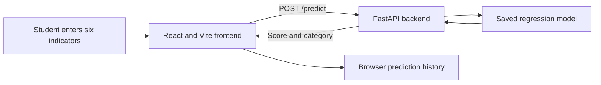

<div align="center">

# 🎓 Student Performance Predictor

### Turn everyday learning habits into a clearer picture of academic progress.

[](https://student-performance-predictor-virid.vercel.app/)
[](https://react.dev/)
[](https://vite.dev/)
[](https://fastapi.tiangolo.com/)

**[Try the live app](https://student-performance-predictor-virid.vercel.app/)** · [View source](https://github.com/mehulikhanra904-prog/student-performance-predictor)

</div>

---

## ✨ About

Student Performance Predictor is a full-stack machine-learning demo that estimates academic performance from study habits and student indicators. Enter six values to receive an estimated score, a performance category, and practical habit-based suggestions.

> **For learning and exploration:** Predictions are estimates based on the project's training data. They are not a definitive measure of a student's ability or future results.

## 🌟 Features

- Estimated score and performance category from a trained regression model.
- Six student indicators covering study, attendance, past scores, assignments, sleep, and participation.
- Personalized suggestions based on the entered values.
- Model evaluation panel with MAE, RMSE, R², and dataset sample counts.
- Recent predictions saved locally in the browser, with a clear-history option.
- Responsive React interface with a soft lavender theme, subtle animated stars, and accessible reduced-motion support.
- FastAPI REST API with validated inputs.

## 🧾 Prediction inputs

| Field | Meaning | Range |
|---|---|---:|
| Study hours | Average study time per day | 0–24 |
| Attendance | Percentage of classes attended | 0–100 |
| Previous score | Most recent academic score | 0–100 |
| Assignments completed | Completed assignments | 0–100 |
| Sleep hours | Average sleep per day | 0–24 |
| Participation | Class participation rating | 1–10 |

## 🧰 Technology

- **Frontend:** React, Vite, JavaScript, CSS
- **Backend:** Python, FastAPI, Pydantic
- **Machine learning:** scikit-learn regression model
- **Model files:** Joblib
- **Hosting:** Vercel (frontend), Render-compatible FastAPI service (backend)

## 🏗️ Architecture


```mermaid
flowchart LR
  U[Student enters six indicators] --> W[React and Vite frontend]
  W -->|POST /predict| A[FastAPI backend]
  A --> M[Saved regression model]
  M --> A
  A -->|Score and category| W
  W --> H[Browser prediction history]
```

## 📁 Project structure

```text
student-performance-predictor/
├── backend/
│   ├── dataset.csv
│   ├── main.py
│   ├── model.pkl
│   ├── model_info.pkl
│   ├── requirements.txt
│   └── train_model.py
├── frontend/
│   ├── src/
│   ├── package.json
│   └── vite.config.js
├── render.yaml
└── README.md
```

## 🚀 Run locally

### Requirements

- Python 3.10+
- Node.js and npm
- Git

### 1. Clone the repository

```bash
git clone https://github.com/mehulikhanra904-prog/student-performance-predictor.git
cd student-performance-predictor
```

### 2. Start the API

```bash
cd backend
python -m venv .venv
```

Activate the environment, install dependencies, and start FastAPI:

**Windows PowerShell**
```powershell
.\.venv\Scripts\Activate.ps1
python -m pip install -r requirements.txt
uvicorn main:app --reload --port 8000
```

**macOS / Linux**
```bash
source .venv/bin/activate
python -m pip install -r requirements.txt
uvicorn main:app --reload --port 8000
```

API root: `http://127.0.0.1:8000` · API docs: `http://127.0.0.1:8000/docs`

### 3. Start the frontend

In a second terminal:

```bash
cd frontend
npm install
```

Create `frontend/.env.local`:

```env
VITE_API_URL=http://127.0.0.1:8000
```

Then run:

```bash
npm run dev
```

Open the Vite URL shown in the terminal, usually `http://localhost:5173`.

## 🔌 API

### `GET /`

Returns an API status message.

### `GET /model-info`

Returns the trained model name, evaluation scores, and training/testing sample counts.

### `POST /predict`

Accepts JSON with all six numeric input fields listed above. Example:

```json
{
  "study_hours": 6,
  "attendance": 85,
  "previous_score": 72,
  "assignments_completed": 8,
  "sleep_hours": 7,
  "participation": 8
}
```

A successful response contains `predicted_score` and `performance`.

## ☁️ Deployment

### Frontend on Vercel

The live frontend is [student-performance-predictor-virid.vercel.app](https://student-performance-predictor-virid.vercel.app/). Configure the Vercel project with:

- **Root directory:** `frontend`
- **Framework:** Vite
- **Build command:** `npm run build`
- **Output directory:** `dist`
- **Environment variable:** `VITE_API_URL` set to the public base URL of the deployed FastAPI service

Redeploy after changing environment variables. The API must allow requests from the frontend's origin.

### Backend on Render

The repository includes `render.yaml` for a Python web service. Configure the backend root directory as `backend`, install `requirements.txt`, and start with:

```bash
uvicorn main:app --host 0.0.0.0 --port $PORT
```

## 🧠 Retrain the model

From the backend directory with dependencies installed:

```bash
python train_model.py
```

Commit and redeploy the updated model artifacts when you want to publish the retrained model.

## 🤝 Contributing

Issues and improvements are welcome. Open a GitHub issue or submit a pull request with a clear summary of the change.

## 📄 License

No license is currently specified. Contact the repository owner before reuse or redistribution.

---

<div align="center">Made with ❤️ for learning and academic insight.</div>
